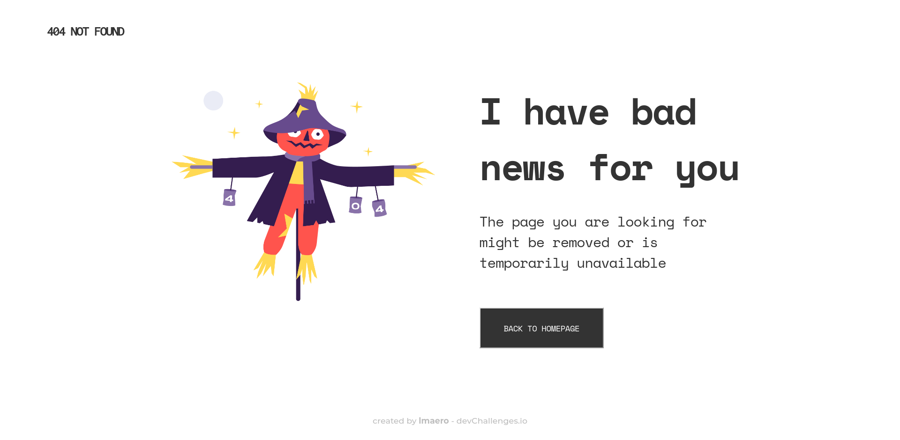

<h1 align="center">404 Not Found by <a href="https://github.com/lmaero">lmaero</a> </h1>

   Solution for a challenge from  <a href="http://devchallenges.io" target="_blank">Devchallenges.io</a>.

  <h3>
    <a href="https://github.com/lmaero/devchallenges.io_rwd-404notFound">
      Demo
    </a>
     | 
    <a href="https://lmaero-404-not-found.netlify.app/">
      Solution
    </a>
     | 
    <a href="https://devchallenges.io/challenges/wBunSb7FPrIepJZAg0sY">
      Challenge
    </a>
  </h3>

<!-- TABLE OF CONTENTS -->

## Table of Contents

- [Overview](#overview)
  - [Built With](#built-with)
- [Features](#features)
- [Contact](#contact)
- [Acknowledgements](#acknowledgements)

<!-- OVERVIEW -->

## Overview

Responsive web design of a 404 not found page, using semantic HTML, media queries and BEM technique. You can see the deployed page in the links above. Successfully validated with W3 HTML and CSS validators.

There's a lot to learn about CSS best practices to avoid code repetition and broken designs, but I think this was a good experience to put in practice what I've learned so far.

### Built With

- HTML5
- CSS3

## Features

This application/site was created as a submission to a [DevChallenges](https://devchallenges.io/challenges) challenge. The [challenge](https://devchallenges.io/challenges/wBunSb7FPrIepJZAg0sY) was to build an application to complete the given user stories.

## Acknowledgements

- [Steps to replicate a design with only HTML and CSS](https://devchallenges-blogs.web.app/how-to-replicate-design/)
- [Marked - a markdown parser](https://github.com/chjj/marked)
- [HTML Validator](https://validator.w3.org/)
- [CSS Validator](https://jigsaw.w3.org/css-validator/)

## Contact

- Website [https://lmaero.pro](https://lmaero.pro)
- GitHub [@lmaero](https://github.com/lmaero)
